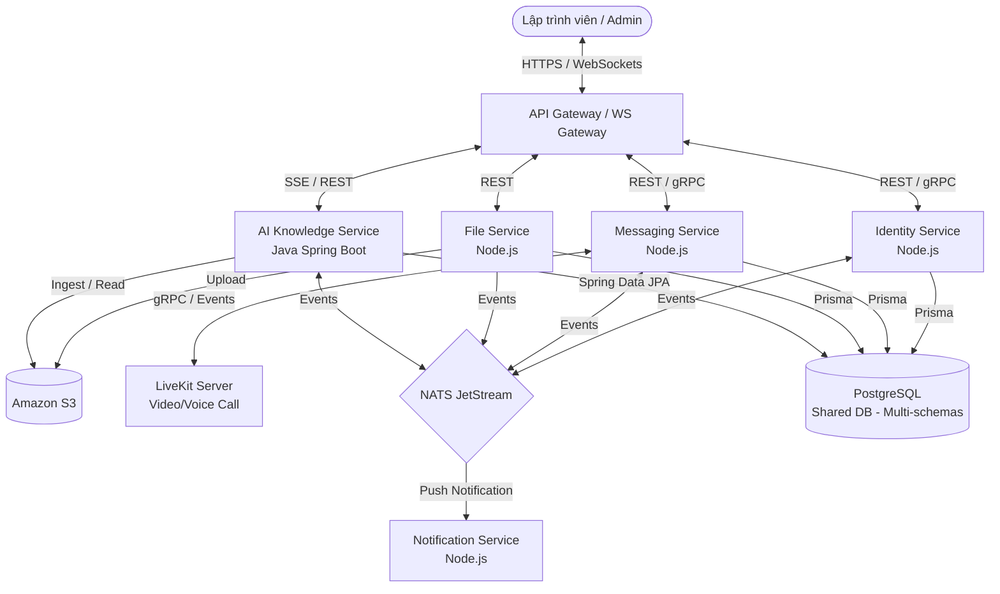
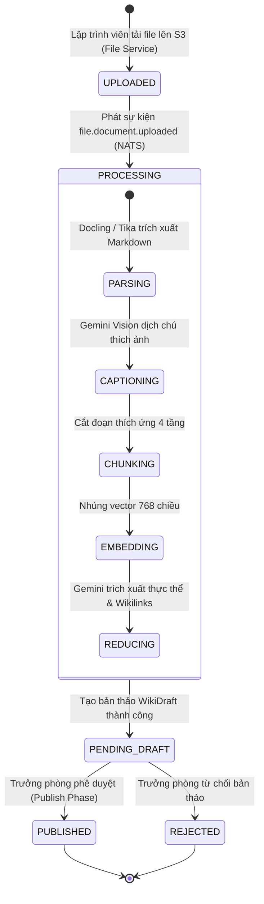

# TÀI LIỆU ĐẶC TẢ YÊU CẦU PHẦN MỀM (SOFTWARE REQUIREMENTS SPECIFICATION - SRS)

## ĐỀ TÀI: NỀN TẢNG TRI THỨC KỸ THUẬT THÔNG MINH CHO ĐỘI NGŨ PHÁT TRIỂN PHẦN MỀM TÍCH HỢP WIKI RAG VÀ AI AGENT VỚI PHÂN QUYỀN ĐA CẤP (RBAC-RAG)

---

## LỊCH SỬ THAY ĐỔI TÀI LIỆU

| Phiên bản | Ngày | Mô tả thay đổi | Tác giả | Trạng thái |
| :--- | :--- | :--- | :--- | :--- |
| **v1.0.0** | 03/07/2026 | Khởi tạo tài liệu đặc tả yêu cầu phần mềm (SRS) chuẩn IEEE 830 | Nhóm nghiên cứu KLTN | Bản thảo hoàn thành |
| **v1.1.0** | 03/07/2026 | Bổ dung đặc tả Use Cases chi tiết, Prototype giao diện, Sequence Diagrams và Activity Diagrams | Nhóm nghiên cứu KLTN | Cập nhật hoàn tất |
| **v1.2.0** | 03/07/2026 | Tích hợp các Sơ đồ hoạt động (Activity Diagrams) chi tiết dựa trên mã nguồn thực tế Java | Nhóm nghiên cứu KLTN | Hoàn thiện đặc tả |
| **v1.3.0** | 03/07/2026 | Sửa lỗi cú pháp Mermaid và di chuyển Sequence Diagrams về dưới Activity Diagrams tương ứng | Nhóm nghiên cứu KLTN | Hoàn thiện thẩm mỹ |

---

## 1. GIỚI THIỆU (INTRODUCTION)

### 1.1. Mục đích (Purpose)
Tài liệu này đặc tả chi tiết các yêu cầu chức năng (Functional Requirements) và yêu cầu phi chức năng (Non-functional Requirements) cho **Nền tảng Tri thức Kỹ thuật Thông minh (Intelligent Technical Knowledge Platform)** tích hợp hệ thống Chat thời gian thực (OTT Chat), bộ biên dịch tri thức Wiki Map-Reduce và trợ lý ảo AI Agent tự hành có phân quyền truy cập thông tin đa cấp (RBAC-RAG).

Tài liệu được biên soạn dựa trên chuẩn **IEEE 830-1998** nhằm cung cấp một nguồn thông tin duy nhất đáng tin cậy (Single Source of Truth) cho:
*   **Hội đồng chấm khóa luận tốt nghiệp**: Đánh giá tính đầy đủ, tính logic học thuật và mức độ hoàn thành kỹ thuật của đề tài.
*   **Đội ngũ phát triển phần mềm**: Làm căn cứ lập trình, thiết kế cơ sở dữ liệu và xây dựng các giao tiếp API/gRPC giữa các dịch vụ.
*   **Đội ngũ đảm bảo chất lượng (QA/QC)**: Thiết kế các kịch bản kiểm thử (Test Cases) kiểm tra tính đúng đắn của chức năng và bảo mật hệ thống.

### 1.2. Phạm vi sản phẩm (Scope)
Sản phẩm phần mềm đặc tả trong tài liệu này là một hệ thống lai đa lớp (Polyglot Multi-tier System) gồm hai phân hệ chính:
1.  **Phân hệ Back-end Chat & Cơ cấu Tổ chức (Node.js Microservices)**:
    *   Đảm nhận các nghiệp vụ xác thực người dùng (JWT), quản lý tổ chức (phòng ban, workspace), truyền tải tin nhắn thời gian thực và quản lý cuộc gọi thoại/video (LiveKit).
    *   Bao gồm 6 dịch vụ hoạt động độc lập: `api-gateway`, `identity-service`, `messaging-service`, `file-service`, `notification-service`, và `ws-gateway`.
2.  **Phân hệ AI Knowledge Service (Java 21 Spring Boot & Spring AI)**:
    *   Đảm nhận đường ống ETL xử lý tri thức (Wiki Compiler MRP Pipeline) và bộ máy suy luận AI Agent (ReAct Loop) tích hợp RAG.
    *   Hiện thực hóa cơ chế bảo mật phân quyền đa cấp ngay tại query-time ở tầng Vector Database (PGVector) và kiểm tra phòng thủ hai lớp (Defense in Depth) ở tầng ứng dụng.

### 1.3. Định nghĩa, Thuật ngữ và Từ viết tắt (Definitions, Acronyms, and Abbreviations)

| Thuật ngữ / Từ viết tắt | Định nghĩa đầy đủ | Ý nghĩa ngữ cảnh trong hệ thống |
| :--- | :--- | :--- |
| **SRS** | Software Requirements Specification | Tài liệu đặc tả yêu cầu phần mềm theo chuẩn cấu trúc công nghiệp. |
| **RAG** | Retrieval-Augmented Generation | Mô hình sinh văn bản kết hợp truy xuất tri thức từ cơ sở dữ liệu vector ngoài để giảm thiểu ảo giác của LLM. |
| **RBAC** | Role-Based Access Control | Kiểm soát truy cập dựa trên vai trò của người dùng trong cơ cấu tổ chức. |
| **RBAC-RAG** | Role-Based Access Control RAG | Cơ chế lọc bảo mật đảm bảo người dùng chỉ được RAG trên các đoạn tri thức mà họ được phép truy cập. |
| **AI Agent** | Autonomous Agent (ReAct) | Thực thể AI tự hành chạy vòng lặp ReAct (Thought-Action-Observation) có khả năng kích hoạt công cụ hệ thống. |
| **gRPC** | Google Remote Procedure Call | Giao thức truyền thông đồng bộ hiệu năng cao sử dụng HTTP/2 và Protobuf. |
| **NATS JetStream** | NATS Event Streaming | Bus thông điệp (Event Bus) bền vững cho giao tiếp bất đồng bộ, phân tán giữa các microservices. |
| **pgvector** | PostgreSQL Vector Extension | Tiện ích mở rộng PostgreSQL hỗ trợ lưu trữ vector 768 chiều và tìm kiếm tương đồng ngữ nghĩa. |
| **IVFFlat** | Inverted File Flat | Chỉ mục phân cụm vector trên pgvector giúp tăng tốc độ truy vấn ở quy mô lớn. |
| **MRP Pipeline** | Map-Reduce-Publish Pipeline | Quy trình ba giai đoạn biên dịch tài liệu thô thành Wiki và Đồ thị tri thức (Knowledge Graph). |
| **Docling** | IBM Document Parser | Bộ công cụ AI trích xuất bố cục trang (layout) và cấu trúc bảng biểu của tài liệu PDF phức tạp. |
| **Virtual Threads** | Java Virtual Threads (Project Loom) | Cơ chế luồng ảo dung lượng siêu nhẹ chạy trên JVM Java 21, tối ưu hóa các tác vụ I/O-bound. |

### 1.4. Tài liệu tham khảo (References)
1.  **Lewis, P. et al. (2020)**. *Retrieval-Augmented Generation for Knowledge-Intensive NLP Tasks*. NeurIPS 2020.
2.  **Yao, S. et al. (2023)**. *ReAct: Synergizing Reasoning and Acting in Language Models*. ICLR 2023.
3.  **Livathinos, N. et al. (2025)**. *Docling: An Efficient Open-Source Toolkit for AI-driven Document Conversion*. IBM Research.
4.  **IEEE Std 830-1998**. *IEEE Recommended Practice for Software Requirements Specifications*. IEEE Computer Society.
5.  **Project Loom - JEP 444 (Java 21)**. *Virtual Threads*. Oracle Corporation.
6.  **Tài liệu Dự án**: [AGENTS.md](file:///d:/Nam4_25-26HK2/agent_cnm/AGENTS.md), [CLAUDE.md](file:///d:/Nam4_25-26HK2/agent_cnm/CLAUDE.md), và bản thảo khóa luận tốt nghiệp [kltn-draft.md](file:///d:/Nam4_25-26HK2/agent_cnm/kltn/kltn-draft.md).

### 1.5. Tổng quan tài liệu (Overview)
Tài liệu này được chia thành các phần chính như sau:
*   **Phần 1**: Giới thiệu tổng quan về mục đích, phạm vi của hệ thống và danh sách thuật ngữ viết tắt.
*   **Phần 2**: Mô tả tổng quan về bối cảnh hệ thống, sơ đồ ngữ cảnh, các chức năng chính, đặc điểm người dùng, ràng buộc kỹ thuật và đặc tả các Use Case cốt lõi kèm theo Sơ đồ hoạt động (Activity Diagrams) tương ứng.
*   **Phần 3**: Đặc tả yêu cầu chi tiết bao gồm giao diện ngoại vi, bản vẽ prototype và mô tả màn hình chi tiết, danh sách các yêu cầu chức năng (FR) dạng bảng, các yêu cầu phi chức năng (NFR) và ràng buộc thiết kế.
*   **Phần 4**: Phụ lục chứa bảng thuật ngữ mở rộng, các sơ đồ phân tích UML kỹ thuật (Sequence Diagrams) và ma trận truy vết yêu cầu (Requirements Traceability Matrix).

---

## 2. MÔ TẢ TỔNG QUAN (OVERALL DESCRIPTION)

### 2.1. Bối cảnh sản phẩm (Product Perspective)
Hệ thống là một nền tảng lai đa dịch vụ hỗ trợ làm việc cộng tác thông minh cho lập trình viên. Nó không hoạt động độc lập mà là sự hợp nhất chặt chẽ giữa hệ thống giao tiếp cộng tác thời gian thực (OTT Chat) và dịch vụ AI xử lý tri thức chuyên sâu.

#### 2.1.1. Sơ đồ Ngữ cảnh Hệ thống (System Context Diagram)
Dưới đây là sơ đồ Mermaid thể hiện cách thức các thành phần trong hệ thống tương tác với nhau và với tác nhân bên ngoài:



#### 2.1.2. Các Giao diện Hệ thống (System Interfaces)
Hệ thống được tổ chức thành 7 dịch vụ độc lập hoạt động trong các container Docker riêng biệt:
1.  **api-gateway (Cổng 3000)**: Điểm tiếp nhận HTTP duy nhất từ Client. Thực hiện định tuyến (routing), xác thực JWT tập trung và đính kèm các header thông tin người dùng (`x-user-id`, `x-user-role`, `x-user-departments`) trước khi chuyển tiếp.
2.  **ws-gateway (Cổng 3001)**: Quản lý các kết nối WebSocket thời gian thực thông qua Socket.IO, duy trì trạng thái trực tuyến của người dùng và đẩy tin nhắn tức thời.
3.  **identity-service (Cổng 3010 / gRPC 50051)**: Quản lý người dùng, cấu trúc tổ chức (phòng ban, vai trò) và cơ chế phân quyền (RBAC). Sở hữu 3 schemas dữ liệu: `auth`, `userorg`, và `rbac`.
4.  **messaging-service (Cổng 3020 / gRPC 50052)**: Quản lý các cuộc hội thoại trực tiếp, hội thoại nhóm, đồng bộ tin nhắn lịch sử và điều phối các phòng họp trực tuyến LiveKit.
5.  **file-service (Cổng 3014)**: Tiếp nhận tải lên tệp tin và đẩy lên AWS S3 hoặc Cloudinary, gắn thẻ bảo mật (security classification) cho tài liệu.
6.  **notification-service (Cổng 3019)**: Lắng nghe sự kiện từ NATS JetStream để gửi email hoặc thông báo đẩy đến người dùng.
7.  **ai-knowledge (Cổng 8080)**: Dịch vụ AI Spring Boot chịu trách nhiệm biên dịch tri thức (Docling/Tika ETL, Adaptive Chunking, Embedding), lưu trữ vector trong PGVector và vận hành AI Agent với cơ chế lọc bảo mật RBAC-RAG.

### 2.2. Các chức năng chính (Product Functions)
Các nhóm chức năng chính được hệ thống cung cấp bao gồm:
*   **Xác thực và Phân quyền đa cấp**: Đăng ký, đăng nhập phi trạng thái bằng cặp Access/Refresh Token; đồng bộ hóa cơ cấu Workspace - Phòng ban (Department) - Vai trò lãnh đạo (Head/Deputy) sang ngữ cảnh bảo mật.
*   **Nhắn tin và Gọi thời gian thực**: Trò chuyện cá nhân, trò chuyện nhóm dự án, stream tin nhắn văn bản, chia sẻ tệp tin và thực hiện cuộc gọi video trực tuyến.
*   **Đường ống trích xuất tri thức (Wiki Ingestion)**: Tự động tải và phân tách tệp PDF/DOCX sang Markdown có cấu trúc, tự động ghi chú thích biểu đồ trực quan, phân đoạn ngữ nghĩa thích nghi và nhúng vector.
*   **Quản trị và Duyệt tri thức Wiki**: Quản lý các bản thảo tri thức (WikiDraft) dạng Map-Reduce, phê duyệt tự động/thủ công và liên kết chéo các trang Wiki để hình thành Đồ thị tri thức (Knowledge Graph).
*   **Hỏi đáp tri thức RAG bảo mật**: Tìm kiếm thông tin bằng ngôn ngữ tự nhiên thông qua cơ chế RAG có tích hợp bộ lọc metadata phân quyền query-time (pre-retrieval) và kiểm tra Defense in Depth ở tầng ứng dụng.
*   **Trợ lý ảo tự hành AI Agent**: Kích hoạt trợ lý ảo thực hiện lập kế hoạch suy luận ReAct và gọi các công cụ gRPC của hệ thống (như tự động tạo Task việc làm, tóm tắt nội dung kênh chat).

### 2.3. Đặc điểm người dùng (User Characteristics)
Hệ thống phân cấp người dùng thành 5 vai trò chính với các đặc điểm và quyền hạn nghiệp vụ khác nhau:
1.  **Super Admin / System Admin**: Có kiến thức kỹ thuật hệ thống sâu. Quản lý toàn bộ cơ cấu hạ tầng, cấu hình tham số AI, cấu hình rate limits và có quyền truy cập toàn bộ tài liệu quy trình mà không bị giới hạn bởi phòng ban hay workspace.
2.  **Org Admin (Quản trị viên tổ chức)**: Quản lý danh sách nhân sự, phân bổ nhân viên vào các phòng ban (Departments), tạo lập các Workspace dự án và cấu hình phân vùng dữ liệu.
3.  **Manager / Head (Trưởng/Phó phòng)**: Người quản lý bộ phận chuyên môn. Có quyền đăng tải tài liệu mật của phòng ban, phê duyệt các bản thảo Wiki (WikiDraft) và yêu cầu AI Agent thực hiện các báo cáo tổng hợp cấp cao.
4.  **Member / Employee (Nhân viên thông thường)**: Lập trình viên, kỹ sư dự án sử dụng hệ thống để làm việc. Có quyền chat thời gian thực, đọc tài liệu quy trình chung hoặc tài liệu thuộc phòng ban của mình, hỏi đáp RAG và tương tác với AI Agent trong phạm vi quyền hạn.
5.  **External Guest (Khách mời bên ngoài)**: Các đối tác hoặc cộng tác viên ngắn hạn. Chỉ được phép tham gia vào các kênh chat được chỉ định và chỉ được RAG/tra cứu các tài liệu được phân loại công khai (`securityClassification = PUBLIC`).

### 2.4. Ràng buộc hệ thống (Constraints)
*   **Tài nguyên phần cứng giới hạn**: Hệ thống phải vận hành ổn định trong môi trường Docker Container bị giới hạn cứng tài nguyên (tối đa 4 Cores CPU và 4GB RAM cho máy chủ phát triển cục bộ).
*   **Bảo mật dữ liệu tuyệt đối**: Không cho phép xảy ra hiện tượng rò rỉ ngữ cảnh (Context Leakage) — thông tin nhạy cảm của cấp quản lý tuyệt đối không được xuất hiện trong câu trả lời RAG của nhân viên thường.
*   **Giới hạn hạn mức API bên ngoài**: Pipeline xử lý Map-Reduce tài liệu lớn phải có cơ chế kiểm soát rate limit của Gemini API (model `gemini-3.1-flash-lite` hoặc `gemini-1.5-flash` miễn phí) để tránh phát sinh lỗi `429 Resource Exhausted`.
*   **Hệ điều hành**: Hỗ trợ triển khai đồng bộ trên Windows 11 Enterprise (qua WSL2 Docker Desktop) và các môi trường máy chủ Linux (Ubuntu Server).

### 2.5. Giả định và Phụ thuộc (Assumptions and Dependencies)
*   **Độ tin cậy của Google Gemini API**: Giả định rằng dịch vụ API của Google hoạt động ổn định với tỷ lệ uptime tối thiểu 99.9%.
*   **Hiệu năng của AWS S3**: Việc tải và lưu trữ tài liệu nhị phân phụ thuộc hoàn toàn vào tốc độ kết nối và tính sẵn sàng của AWS S3 hoặc MinIO tương thích.
*   **Tính nhất quán của Cơ sở dữ liệu**: Giả định rằng PostgreSQL pgvector được cài đặt đúng chỉ mục IVFFlat và không gặp hiện tượng xung đột dữ liệu chéo schema.

### 2.6. Đặc tả Use Case Chi tiết (Detailed Use Cases)

#### 2.6.1. UC-RAG-001: Hỏi đáp RAG bảo mật đa tầng

| Đặc tả | Nội dung |
| :--- | :--- |
| **Tên use case** | **UC-RAG-001: Hỏi đáp RAG bảo mật đa tầng** |
| **Mục đích** | Cung cấp khả năng truy vấn tri thức kỹ thuật nội bộ an toàn bằng ngôn ngữ tự nhiên, ngăn ngừa tuyệt đối rò rỉ dữ liệu (Context Leakage) chéo bộ phận hoặc theo phân cấp bảo mật. |
| **Mô tả sơ lược** | Lập trình viên nhập câu hỏi quy trình/kỹ thuật. Hệ thống xác thực JWT, lấy ngữ cảnh phòng ban và vai trò để sinh biểu thức bộ lọc động tại vector store (Pre-retrieval). Sau khi truy xuất, hệ thống kiểm tra phân quyền cấp trang lần 2 (Post-retrieval) trước khi tổng hợp câu trả lời thông qua Gemini LLM dưới dạng stream SSE. |
| **Actor chính** | Nhân viên thường (Member) / Trưởng phòng (Head) |
| **Tiền điều kiện (Precondition)** | Người dùng đã đăng nhập vào hệ thống, sở hữu token JWT hợp lệ và đang ở màn hình chat hỗ trợ tri thức. |
| **Hậu điều kiện (Postcondition)** | Câu trả lời được stream về phía client đầy đủ, an toàn, không chứa thông tin vượt quá quyền hạn của người dùng. |

7. **Luồng sự kiện chính**:

| Bước | Tác nhân (Actor) | Hệ thống |
| :--- | :--- | :--- |
| **1** | Người dùng nhập câu hỏi (ví dụ: "Quy trình lương thưởng quý 3 được phê duyệt như thế nào?") và bấm gửi. | |
| **2** | | **API Gateway** tiếp nhận request, xác thực JWT token qua header `Authorization: Bearer <token>`. |
| **3** | | **API Gateway** phân giải token, lấy ra thông tin vai trò phòng ban của người dùng từ cache Redis, đính kèm vào các HTTP header chuẩn hóa (`x-user-id`, `x-user-departments`, `x-user-role-level`) và định tuyến đến `ChatController` của Java AI Service. |
| **4** | | **ChatController** giải mã các header bảo mật và khởi dựng đối tượng `UserPermissionContext`. |
| **5** | | **RAGService** kiểm tra lịch sử hội thoại gần nhất (tối đa 6 tin nhắn). Nếu có lịch sử, gọi Gemini viết lại câu hỏi thành Standalone Query. |
| **6** | | **RAGService.buildFilterExpressionAST()** nhận context phân quyền, kết xuất ra cây cú pháp bộ lọc (Filter Expression AST) bao gồm các điều kiện logic (AND/OR) dựa trên vai trò (Admin, Guest, Employee) và departmentId/workspaceId. |
| **7** | | **Spring AI Vector Store** biên dịch AST thành mệnh đề SQL `WHERE` trên các trường metadata JSONB của bảng `vector_store` (Pre-retrieval filtering) và thực hiện tìm kiếm tương đồng pgvector. |
| **8** | | **RAGService.isPageAccessible()** duyệt qua từng trang Wiki chứa chunk tài liệu thu được từ CSDL để kiểm tra quyền truy cập lần 2 ở cấp ứng dụng (Post-retrieval check / Defense in Depth). |
| **9** | | **RAGService** tính toán chỉ số tin cậy (Confidence Score) dựa trên điểm tương đồng max và average của các chunks hợp lệ. |
| **10** | | **RAGService** đóng gói ngữ cảnh, prompt hệ thống chứa điểm tin cậy và gọi Gemini API để nhận luồng tokens câu trả lời. |
| **11** | | **ChatController** stream câu trả lời dạng JSON SSE về Web/Mobile Client. |
| **12** | | **ConversationService** lưu câu hỏi gốc và câu trả lời hoàn chỉnh vào CSDL để phục vụ ngữ cảnh hội thoại. |

8. **Luồng rẽ nhánh**:

| Nhánh | Tác nhân (Actor) | Hệ thống |
| :--- | :--- | :--- |
| **ALT-1.1 (Admin/Super Admin)** | Người dùng gửi câu hỏi và thuộc nhóm Admin. | Hệ thống sinh biểu thức lọc RAG không giới hạn departmentId hay workspaceId, cho phép tra cứu toàn bộ cơ sở tri thức. Admin có thể truyền x-rag-scope để tự giới hạn phạm vi tìm kiếm theo department hoặc workspace cụ thể. |
| **ALT-1.2 (Khách mời - Guest)** | Người dùng gửi câu hỏi và có vai trò GUEST. | Hệ thống giới hạn biểu thức lọc RAG cứng, chỉ cho phép lấy ra các chunks tài liệu có nhãn bảo mật là `PUBLIC`. |

9. **Ngoại lệ**:

| Ngoại lệ | Tác nhân (Actor) | Hệ thống |
| :--- | :--- | :--- |
| **EXC-1.1 (JWT hết hạn/lỗi)** | Người dùng gửi yêu cầu nhưng token JWT đã hết hạn hoặc không hợp lệ. | API Gateway phát hiện lỗi, chặn request và trả về mã lỗi HTTP 401 Unauthorized ngay lập tức. Client điều hướng người dùng về trang đăng nhập. |
| **EXC-1.2 (Không tìm thấy tài liệu phù hợp)** | Người dùng gửi câu hỏi nhưng các kết quả tìm kiếm tương đồng hoặc bộ lọc phân quyền không giữ lại được chunk tài liệu nào. | RAGService bỏ qua bước gọi LLM để tiết kiệm chi phí, trực tiếp sinh câu trả lời tĩnh: "Không tìm thấy thông tin liên quan trong tài liệu nội bộ." kèm confidence score = 0.0. |
| **EXC-1.3 (Lỗi cạn quota API Gemini - HTTP 429)** | | Khi luồng gọi Gemini API trả về lỗi rate limit, hệ thống bắt lỗi, stream thông báo hệ thống AI đang quá tải và đề xuất người dùng thử lại sau. |

*   **Sơ đồ Hoạt động (Activity Diagram)**:
    ```mermaid
    flowchart TD
        Start([Bắt đầu]) --> Input[Nhận câu hỏi và token JWT từ Web/Mobile Client]
        Input --> VerifyJWT{Xác thực JWT tại API Gateway?}
        
        VerifyJWT -->|Thất bại| Err401[Trả về lỗi 401 Unauthorized] --> End([Kết thúc])
        
        VerifyJWT -->|Thành công| SetHeaders[Bơm thông tin phân quyền vào x-user-* headers]
        SetHeaders --> RouteRequest[API Gateway định tuyến request đến ChatController]
        
        RouteRequest --> BuildContext[ChatController phân giải headers dựng UserPermissionContext]
        BuildContext --> CheckHistory{Có lịch sử hội thoại?}
        
        CheckHistory -->|Có| RewriteQuery[Gọi Gemini API viết lại câu hỏi thành Standalone Query] --> ExecSearch
        CheckHistory -->|Không| KeepQuery[Giữ nguyên câu hỏi gốc] --> ExecSearch
        
        ExecSearch[Bắt đầu Tìm kiếm lai Hybrid Search] --> CallAST[RAGService.buildFilterExpressionAST]
        CallAST --> GetWorkspaceDept[Lấy departmentId của Workspace qua gRPC Client]
        
        GetWorkspaceDept --> CheckRole{Vai trò người dùng?}
        
        CheckRole -->|SUPER_ADMIN / ADMIN| AdminFilter[Lọc theo Workspace và departmentId của Workspace] --> VectorSearch
        CheckRole -->|EXTERNAL_GUEST| GuestFilter[Lọc theo Workspace và securityClassification == PUBLIC] --> VectorSearch
        CheckRole -->|Nhân viên thường| EmpFilter[Dựng OR-chain cho Workspace, phòng ban và allowedRoles != HEAD] --> VectorSearch
        
        VectorSearch[pgvector thực thi similaritySearch có pre-retrieval filter SQL] --> PostCheck[Post-retrieval check: RAGService.isPageAccessible]
        
        PostCheck --> CheckDocs{Có chunks tài liệu phù hợp?}
        
        CheckDocs -->|Không| FallbackNoDocs[Trả về JSON summary: Không tìm thấy thông tin - confidence=NONE] --> StreamSSE
        
        CheckDocs -->|Có| CalcConfidence[Tính toán Confidence Score kết hợp max & avg score]
        CalcConfidence --> GuardConfidence{Confidence Score >= 0.25?}
        
        GuardConfidence -->|Không| FallbackNoDocs
        GuardConfidence -->|Có| AssemblePrompt[Đóng gói Context và System Prompt chứa Confidence Score]
        
        AssemblePrompt --> CallGemini[Gọi Gemini API sinh câu trả lời có cấu trúc JSON]
        CallGemini --> StreamSSE[Stream câu trả lời dạng SSE về Client]
        
        StreamSSE --> SaveChat[Lưu câu hỏi gốc và câu trả lời vào Conversation Database] --> End
    ```
*   **Sơ đồ Tuần tự (Sequence Diagram) - Luồng xử lý hỏi đáp RAG Bảo mật hai lớp**:
    ```mermaid
    sequenceDiagram
        autonumber
        actor Dev as Lập trình viên (Member)
        participant FE as Next.js Web Front-end
        participant GW as API Gateway (Cổng 3000)
        participant CC as ChatController (Java AI)
        participant RS as RAGService (Java AI)
        participant DB as PostgreSQL (pgvector)
        participant G as Gemini API (Cloud)

        Dev->>FE: Gửi câu hỏi "Kế hoạch quý 3?"
        FE->>GW: POST /chat/messages (Header Authorization: JWT)
        Note over GW: 1. Giải mã JWT và xác thực<br/>2. Lấy phòng ban & vai trò từ Redis<br/>3. Bơm x-user-* headers
        GW->>CC: POST /chat/messages (Đầy đủ headers phân quyền)
        CC->>RS: generateAnswerStream(conversationId, message, permissionsContext)
        
        RS->>RS: buildFilterExpressionAST(permissionsContext)
        Note over RS: Sinh biểu thức AST dựa trên:<br/>WorkspaceId, userDepartments, roles<br/>và allowedRoles != 'HEAD'
        
        RS->>DB: Thực hiện similarity search với filter AST
        Note over DB: Pre-retrieval filtering:<br/>Biên dịch AST thành mệnh đề SQL WHERE<br/>trên metadata JSONB trước khi ANN search
        DB-->>RS: Trả về danh sách các chunks tài liệu thô
        
        loop Duyệt từng WikiPage nguồn của các chunks
            RS->>RS: isPageAccessible(wikiPage, permissionsContext)
            Note over RS: Post-retrieval check (Defense in Depth):<br/>Đảm bảo không rò rỉ ranh giới bộ phận
        end
        
        RS->>RS: Tổng hợp chunks hợp lệ → Prompt context
        RS->>G: Gọi chat client (System instructions + Prompt)
        
        loop Stream câu trả lời
            G-->>RS: Trả về token text
            RS-->>CC: Trực tiếp stream token
            CC-->>FE: Stream SSE (text/event-stream)
            FE-->>Dev: Cập nhật text liên tục trên giao diện
        end
    ```

#### 2.6.2. UC-ETL-002: Đăng tải và Biên dịch tài liệu Wiki (MRP Pipeline)

| Đặc tả | Nội dung |
| :--- | :--- |
| **Tên use case** | **UC-ETL-002: Đăng tải và Biên dịch tài liệu Wiki (MRP Pipeline)** |
| **Mục đích** | Tự động hóa quy trình trích xuất tài liệu thô (PDF/DOCX) thành các trang tri thức Wiki có cấu trúc Markdown, tự động sinh chú thích hình ảnh, tạo các liên kết chéo và đưa vào hàng chờ duyệt WikiDraft. |
| **Mô tả sơ lược** | Người dùng tải tài liệu quy trình lên hệ thống và cấu hình mức độ bảo mật. Hệ thống lưu tài liệu lên S3 và kích hoạt pipeline Map-Reduce qua NATS JetStream. Hệ thống sử dụng Virtual Threads chạy song song các luồng phân tích Docling/Tika, Gemini Vision dịch hình ảnh, nhúng vector pgvector, gom cụm và đề xuất Wikilinks chéo. |
| **Actor chính** | Trưởng phòng (Head) / Quản trị viên (Admin) |
| **Tiền điều kiện (Precondition)** | Người dùng có tài khoản với vai trò quản lý (HEAD/MANAGER) hoặc ADMIN. |
| **Hậu điều kiện (Postcondition)** | Bản thảo WikiDraft trạng thái PENDING được ghi nhận trong CSDL kèm danh mục tags và Wikilinks đề xuất. |

7. **Luồng sự kiện chính**:
| Bước | Tác nhân (Actor) | Hệ thống |
| :--- | :--- | :--- |
| **1** | Người dùng truy cập Wiki Portal, kéo thả tệp tài liệu (PDF/DOCX), chọn cấp độ bảo mật (CONFIDENTIAL/INTERNAL) và workspace áp dụng, sau đó nhấn "Biên dịch". | |
| **2** | | **Web Frontend** kiểm tra định dạng và kích thước tệp, sau đó gửi request multipart/form-data qua API Gateway đến `file-service`. |
| **3** | | **file-service** lưu trữ file vật lý lên AWS S3 bucket, ghi metadata vào bảng `files.file` và phát sự kiện `file.document.uploaded` tới NATS JetStream. |
| **4** | | **ai-knowledge** nhận sự kiện từ NATS JetStream, tạo bản ghi `Document` ở trạng thái `PROCESSING`. |
| **5** | | **MrpPipelineService** khởi chạy bất đồng bộ quy trình biên dịch (Map-Reduce). |
| **6** | | **Map Phase**: Hệ thống chia văn bản thành các trang thô. Sử dụng **Java 21 Virtual Threads** để song song hóa việc gọi Docling Client trích xuất Markdown có cấu trúc bảng biểu. |
| **7** | | **Map Phase (Vision)**: Với các ảnh sơ đồ nhúng phát hiện trong trang, hệ thống render ra PNG và gửi lên Gemini Vision để sinh caption mô tả bằng tiếng Việt, đính kèm lại vào Markdown. |
| **8** | | **Map Phase (Embedding)**: Chunks Markdown được cắt bằng thuật toán Adaptive Chunking 4 tầng (dưới 8000 ký tự) và gửi lên Gemini Embedding API để nhúng vector 768 chiều, sau đó lưu vào pgvector. |
| **9** | | **Reduce Phase**: Hệ thống gom tất cả kết quả trích xuất, thực hiện lọc trùng lặp thực thể chéo, đối chiếu phiên bản với các WikiPages hiện có trong CSDL. |
| **10** | | **Reduce Phase (Plan Optimization)**: Gọi Gemini API sắp xếp sơ đồ cây thư mục (tags/folders) và đề xuất các Wikilinks chéo dạng `[[Wikilinks]]`, lưu thành `SourceCompilationPlan`. |
| **11** | | **Publish Phase**: Tạo các bản thảo `WikiPageDraft` trạng thái `PENDING` chờ phê duyệt. |

8. **Luồng rẽ nhánh**:

| Nhánh | Tác nhân (Actor) | Hệ thống |
| :--- | :--- | :--- |
| **ALT-2.1 (Tự động duyệt)** | Hệ thống được cấu hình tự động duyệt kế hoạch biên soạn (`autoApprove = true`). | MrpPipelineService bỏ qua bước chờ Trưởng phòng duyệt thủ công, trực tiếp kích hoạt hàm `approveDraft()` để xuất bản các trang Wiki và ghi nhận liên kết đồ thị vào bảng `wiki_links`. |
| **ALT-2.2 (Parser Fallback)** | | Khi dịch vụ phân tích Docling Client bị ngoại tuyến hoặc quá tải, hệ thống tự động fallback sử dụng `Apache Tika` để lấy văn bản phẳng và dùng bộ parser định dạng lại thành Markdown. |

9. **Ngoại lệ**:

| Ngoại lệ | Tác nhân (Actor) | Hệ thống |
| :--- | :--- | :--- |
| **EXC-2.1 (Tệp quá lớn)** | Người dùng tải lên tệp lớn hơn 50MB. | Giao diện Web Frontend hiển thị cảnh báo lỗi và chặn không cho gửi request tải lên hệ thống. |
| **EXC-2.2 (Lỗi Quota API trong batch compilation)** | | Trong quá trình xuất bản hàng loạt trang Wiki chéo liên kết, nếu phát sinh lỗi `429 Resource Exhausted` từ Gemini, module `WikiIssueService` sẽ bắt lỗi cục bộ và ghi nhận dưới dạng log warning thay vì ném exception phá vỡ transaction biên dịch. |

*   **Sơ đồ Hoạt động (Activity Diagram)**:
    ```mermaid
    flowchart TD
        Start([Bắt đầu]) --> Upload[HEAD tải tài liệu quy trình PDF/DOCX lên]
        Upload --> CheckSize{Dung lượng file > 50MB?}
        
        CheckSize -->|Có| ErrSize[Từ chối và báo lỗi dung lượng vượt quá giới hạn] --> End([Kết thúc])
        CheckSize -->|Không| UploadS3[File Service tải file lên AWS S3]
        
        UploadS3 --> SaveMeta[Lưu metadata của tệp vào bảng files.file]
        SaveMeta --> EmitEvent[Phát sự kiện file.document.uploaded sang NATS JetStream]
        
        EmitEvent --> JavaListen[NatsDocumentSubscriber của ai-knowledge nhận sự kiện]
        JavaListen --> SaveDoc[Tạo bản ghi Document trạng thái PROCESSING]
        
        SaveDoc --> StartETL[Khởi chạy MrpPipelineService.runPipeline bất đồng bộ]
        
        subgraph Map Phase
            StartETL --> RenderPDF[Render tuần tự các trang PDF thành ảnh PNG 96 DPI]
            RenderPDF --> SpawnThreads[Khởi chạy Virtual Threads song song cho từng trang]
            
            SpawnThreads --> Parser{Chọn bộ parser?}
            Parser -->|Mặc định: Docling| DoclingParse[Docling Client phân tích layout và cấu trúc bảng]
            DoclingParse --> CheckDocling{Thành công?}
            
            CheckDocling -->|Có| GeminiVision[Gemini Vision sinh mô tả caption cho ảnh nhúng] --> AdaptChunk
            CheckDocling -->|Không| FallbackTika[Apache Tika trích xuất văn bản phẳng] --> AdaptChunk
            
            AdaptChunk[Adaptive Chunking 4 tầng cắt nhỏ văn bản dưới 8000 kí tự] --> EmbedAPI[Gemini Embedding API nhúng vector 768 chiều]
            EmbedAPI --> SavePG[Ghi đè chunks & vector vào PostgreSQL pgvector]
        end
        
        SavePG --> JoinThreads[CompletableFuture.allOf.join - Chờ các luồng hoàn thành]
        
        subgraph Reduce Phase
            JoinThreads --> RetrieveChunks[Lấy tất cả chunk DONE của tài liệu]
            RetrieveChunks --> Dedup[Deduplicate thực thể & khái niệm, ghép claims]
            Dedup --> Reconcile[Đối chiếu trùng lặp với các WikiPages hiện có]
            Reconcile --> CallLLMPlan["Gọi Gemini tối ưu hóa danh mục, folder tags và đề xuất [[Wikilinks]]"]
            CallLLMPlan --> SavePlan[Lưu SourceCompilationPlan planJson & đổi status PENDING_REVIEW]
        end
        
        SavePlan --> CheckAuto{autoApprove = true?}
        
        CheckAuto -->|Không| Review[HEAD duyệt thủ công kế hoạch biên soạn]
        Review --> HeadDecision{Duyệt hay từ chối?}
        
        HeadDecision -->|Từ chối| Reject[Cập nhật status REJECTED] --> End
        HeadDecision -->|Chấp thuận| Publish[Tạo/Cập nhật WikiPageDrafts dạng PENDING] --> ExecutePublish
        
        CheckAuto -->|Có| Publish
        
        subgraph Publish Phase
            ExecutePublish[ApproveDraft: Xác thực và chuyển đổi Draft sang PUBLISHED]
            ExecutePublish --> VectorizeWiki[Nhúng vector nội dung trang Wiki mới]
            VectorizeWiki --> ScanLinks["Quét nội dung tìm [[Wikilinks]] để tạo liên kết wiki_links"]
            ScanLinks --> UpdateGraph[Cập nhật các cạnh trong Đồ thị tri thức Wiki]
        end
        
        UpdateGraph --> End
    ```
*   **Sơ đồ Tuần tự (Sequence Diagram) - Luồng biên dịch tri thức Wiki MRP Pipeline**:
    ```mermaid
    sequenceDiagram
        autonumber
        actor Head as Trưởng phòng (HEAD)
        participant FS as File Service (Node.js)
        participant NATS as NATS JetStream
        participant AI as AI Knowledge Service (Java)
        participant Doc as Docling (IBM API)
        participant G as Gemini API (Embedding & Vision)
        participant DB as PostgreSQL (JPA DB)

        Head->>FS: Tải lên tài liệu HR-Rules.pdf (department=DEPT_HR, allowedRoles=MEMBER)
        FS->>NATS: Publish event "file.document.uploaded" (S3 URL + Metadata)
        FS-->>Head: Trả về HTTP 200 (Đang xử lý nền)
        
        NATS->>AI: Trigger NatsDocumentSubscriber nhận event
        AI->>DB: Tạo bản ghi Document (status = PROCESSING)
        AI->>AI: Khởi chạy MrpPipelineService.runPipeline()
        
        Note over AI: Phase 1: MAP Phase (Tuần tự render ảnh PDF)
        loop Mỗi trang PDF
            AI->>AI: Render trang thành PNG (96 DPI grayscale)
        end
        
        Note over AI: Phase 2: REDUCE Phase (Song song hóa qua Virtual Threads)
        par Mỗi trang PDF
            AI->>Doc: Gọi convertToMarkdown()
            Doc-->>AI: Trả về cấu trúc Markdown & Bảng biểu
            AI->>G: Gọi parseImage() sinh caption cho sơ đồ nhúng (Gemini Vision)
            G-->>AI: Trả về văn bản mô tả caption
            AI->>AI: Cắt đoạn thích ứng (Adaptive Chunking 4 tầng)
            AI->>G: Nhúng vector từng chunk (gemini-embedding-001)
            G-->>AI: Trả về vector 768 chiều
            AI->>DB: Lưu các chunks & vector vào pgvector
        end
        
        AI->>G: Gọi sinh đề xuất Wikilinks chéo (Entity extraction)
        G-->>AI: Trả về danh sách Wikilinks đề xuất
        AI->>DB: Tạo bản thảo WikiPageDraft (status = PENDING)
        
        Note over AI: Phase 3: PUBLISH Phase (Phê duyệt)
        Head->>AI: POST /wiki/drafts/{id}/approve (HEAD review)
        AI->>DB: Cập nhật WikiPage trạng thái PUBLISHED
        AI->>DB: Cập nhật đồ thị liên kết chéo vào wiki_links
        AI-->>Head: Trả về thông báo xuất bản thành công
    ```

#### 2.6.3. UC-AGENT-003: AI Agent suy luận ReAct và gọi công cụ (Tool Call)
| Đặc tả | Nội dung |
| :--- | :--- |
| **Tên use case** | **UC-AGENT-003: AI Agent suy luận ReAct và gọi công cụ (Tool Call)** |
| **Mục đích** | Cho phép lập trình viên tương tác với trợ lý ảo tự hành để thực hiện các tác vụ phức tạp liên quan đến vận hành hệ thống (như quản lý Task) và tra cứu tri thức chéo. |
| **Mô tả sơ lược** | Người dùng nhập yêu cầu hành động bằng ngôn ngữ tự nhiên. Agent khởi chạy vòng lặp ReAct, phân tích ý định (Thought), quyết định gọi công cụ nghiệp vụ tương ứng (Action). Hệ thống thực thi công cụ qua gRPC hoặc gọi RAGService có kèm kiểm tra phân quyền, tổng hợp kết quả (Observation) và trả phản hồi cuối cùng (Final Answer) cho người dùng. |
| **Actor chính** | Nhân viên thường (Member) / Trưởng phòng (Head) |
| **Tiền điều kiện (Precondition)** | Người dùng đang ở trong giao diện chat hỗ trợ AI Agent. |
| **Hậu điều kiện (Postcondition)** | Tác vụ nghiệp vụ được thực hiện thành công và ghi nhận vào cơ sở dữ liệu hệ thống tương ứng. |

7. **Luồng sự kiện chính**:
| Tác nhân (Actor) | Hệ thống |
| :--- | :--- |
| **1.** Người dùng nhập yêu cầu hành động (ví dụ: "Agent ơi, hãy tạo một task cho @nguyenvana kiểm tra lỗi CI/CD trước ngày 05/07") và bấm gửi. | |
| | **2.** `AgentService.runAgent()` tiếp nhận request kèm `UserPermissionContext` được truyền từ HTTP headers. |
| | **3.** `AgentService` nạp lịch sử hội thoại, System Prompt, danh sách công cụ đăng ký (`AgentToolConfig`) và khởi tạo luồng suy luận. |
| | **4.** LLM (Gemini) phân tích yêu cầu (Thought) và sinh chuỗi JSON yêu cầu hành động (Action) chỉ định gọi công cụ `createTask` kèm tham số `title="Kiểm tra lỗi CI/CD"`, `assignee="nguyenvana"`, `deadline="2026-07-05"`. |
| | **5.** Spring AI `AgentToolConfig` bắt cuộc gọi công cụ, thực hiện kiểm tra quyền tạo Task của người dùng dựa trên `UserPermissionContext`. |
| | **6.** `AgentToolConfig` thực thi gRPC call đến `messaging-service` (cổng 50052) yêu cầu tạo task. |
| | **7.** `messaging-service` ghi nhận Task mới vào database, gán ID và trả kết quả về cho Java AI Service. |
| | **8.** `AgentService` nhận kết quả thành công và chuyển thành Observation đưa ngược lại vào prompt suy luận của LLM. |
| | **9.** LLM (Gemini) nhận Observation, suy luận bước tiếp theo và sinh ra câu trả lời cuối cùng (Final Answer) kèm theo đường dẫn liên kết đến Task vừa tạo. |
| | **10.** `AgentService` lưu cuộc trò chuyện vào CSDL và stream câu trả lời cuối cùng qua SSE về Client. |

8. **Luồng rẽ nhánh**:

| Nhánh | Tác nhân (Actor) | Hệ thống |
| :--- | :--- | :--- |
| **ALT-3.1 (Gọi công cụ tra cứu tri thức)** | Người dùng hỏi câu hỏi yêu cầu tra cứu tài liệu mật (ví dụ: "Đọc quy trình bảo mật hệ thống"). | Agent quyết định gọi công cụ `read_wiki_page` hoặc `searchKnowledge`. Hệ thống bắt buộc đối chiếu `isPageAccessible()` và `buildFilterExpressionAST()` sử dụng quyền hạn của người dùng. Nếu không có quyền, công cụ trả về Observation dạng lỗi phân quyền "Access Denied". |

9. **Ngoại lệ**:

| Ngoại lệ | Tác nhân (Actor) | Hệ thống |
| :--- | :--- | :--- |
| **EXC-3.1 (Lỗi kết nối gRPC hoặc Timeout)** | | Khi lệnh gọi gRPC từ Java Service sang Node.js `messaging-service` bị timeout hoặc gián đoạn mạng, hệ thống đóng gói ngoại lệ này thành Observation gửi lại cho LLM. Agent suy luận và phản hồi: "Hệ thống tạo Task đang gặp lỗi kết nối nội bộ. Vui lòng thử lại sau." |

*   **Sơ đồ Hoạt động (Activity Diagram)**:
    ```mermaid
    flowchart TD
        Start([Bắt đầu]) --> InputMsg[Lập trình viên nhập tin nhắn yêu cầu cho Agent]
        InputMsg --> InitAgent[AgentService.runAgent khởi tạo Agent ToolConfig & Chat Memory]
        
        InitAgent --> Thought[Thought: LLM phân tích ngữ cảnh và lập kế hoạch]
        Thought --> Decision{Quyết định hành động?}
        
        Decision -->|Cần gọi công cụ| Action[Action: Trả về tên Tool & tham số dạng JSON]
        Decision -->|Trả lời trực tiếp| FinalAnswer[Final Answer: Tổng hợp câu trả lời cuối cùng]
        
        Action --> CallBack[Spring AI Callback chặn và định tuyến công cụ]
        CallBack --> CheckAuth[Đối chiếu UserPermissionContext truyền vào tool]
        
        CheckAuth --> VerifyTool{Quyền hạn đối với công cụ?}
        
        VerifyTool -->|Từ chối| RejectTool[Tạo Observation: Bạn không có quyền gọi công cụ này] --> Thought
        VerifyTool -->|Chấp thuận| ExecTool{Thực thi công cụ nào?}
        
        ExecTool -->|searchKnowledge| ToolSearch[Gọi RAGService tìm tri thức có pre-retrieval filter]
        ExecTool -->|createTask| ToolTask[Gọi gRPC Client sang messaging-service tạo Task]
        ExecTool -->|read_wiki_page| ToolWiki[Kiểm tra isPageAccessible và đọc Wiki Page]
        
        ToolSearch --> ReturnSearch[Tích lũy kết quả tìm kiếm làm Observation] --> Thought
        ToolTask --> ReturnTask[Tích lũy Task ID và trạng thái làm Observation] --> Thought
        ToolWiki --> ReturnWiki[Tích lũy Markdown nội dung làm Observation] --> Thought
        
        FinalAnswer --> SaveChat[Lưu câu trả lời vào Conversation Database]
        SaveChat --> StreamOutput[Stream câu trả lời JSON qua SSE về Client] --> End([Kết thúc])
    ```
*   **Sơ đồ Tuần tự (Sequence Diagram) - Luồng suy luận ReAct và gọi công cụ của AI Agent**:
    ```mermaid
    sequenceDiagram
        autonumber
        actor User as Lập trình viên (Member/Head)
        participant FE as Next.js Web Front-end
        participant GW as API Gateway (Cổng 3000)
        participant AS as AgentService (Java AI)
        participant G as Gemini API (Cloud)
        participant ATC as AgentToolConfig (Spring AI Tools)
        participant MS as messaging-service (Node.js gRPC)
        participant DB as PostgreSQL (JPA DB)

        User->>FE: Gửi yêu cầu: "Tạo task kiểm tra lỗi CI/CD cho @nguyenvana"
        FE->>GW: POST /agent/chat (JWT Header)
        Note over GW: 1. Xác thực JWT<br/>2. Lấy phòng ban người dùng<br/>3. Bơm x-user-* headers
        GW->>AS: POST /agent/chat (Headers)
        AS->>AS: runAgent(conversationId, message, permissionsContext)
        
        loop Vòng lặp ReAct (Thought-Action-Observation)
            AS->>G: Gửi prompt (System Prompt + Lịch sử + Yêu cầu)
            G-->>AS: Trả về Action (Tên Tool: createTask, Tham số JSON)
            
            Note over AS: Spring AI callback bắt cuộc gọi tool
            AS->>ATC: Kích hoạt tool createTask(title, assignee, deadline)
            ATC->>ATC: Đối chiếu UserPermissionContext (Kiểm tra quyền tạo task)
            
            alt Quyền hạn hợp lệ
                ATC->>MS: Gọi gRPC createTask(title, assignee, deadline) (Port 50052)
                MS->>DB: Ghi nhận Task mới vào bảng messaging.task
                DB-->>MS: Trả về Task ID
                MS-->>ATC: Trả về Task ID & Status (Success)
                Note over ATC: Observation: Task created with ID TSK-102
            else Quyền hạn không hợp lệ
                Note over ATC: Observation: Quyền hạn bị từ chối
            end
            
            ATC-->>AS: Trả về Observation kết quả
            AS->>G: Gửi Observation kết quả vào ngữ cảnh hội thoại
            G-->>AS: Trả về Final Answer (JSON chứa summary, details, sources)
        end
        
        AS->>DB: Lưu tin nhắn Agent vào Conversation DB
        AS-->>GW: Stream câu trả lời cuối cùng dạng SSE
        GW-->>FE: Stream SSE (text/event-stream)
        FE-->>User: Hiển thị thông tin Task đã tạo & đường link truy cập
    ```

---

## 3. YÊU CẦU CHI TIẾT (SPECIFIC REQUIREMENTS)

### 3.1. Yêu cầu Giao diện Ngoại vi (External Interface Requirements)

#### 3.1.1. Giao diện Người dùng (User Interfaces)

##### 3.1.1.1. Giao diện Chat thông minh & AI Agent Workspace (Secure Chat Interface)

**Mô tả màn hình**: 
*   **Cột 1 (Sidebar trái)**: Danh sách các kênh chat nhóm dự án và các cuộc hội thoại riêng tư với AI Agent.
*   **Cột 2 (Khung chat chính)**: Vùng hiển thị nội dung tin nhắn. Tin nhắn của AI được render dưới dạng Markdown, có nút "Xem chi tiết nguồn trích xuất" để hiển thị danh sách tài liệu tham khảo. Hệ thống có thanh hiển thị trạng thái suy luận động của AI Agent (Thought -> Action -> Observation).
*   **Cột 3 (Sidebar phải)**: Hiển thị ngữ cảnh bảo mật hiện tại của người dùng (Workspace đang truy cập, phòng ban thực tế, cấp độ vai trò) và danh sách các tài liệu RAG đã được lọc tương ứng. Cột này cũng chứa danh sách các Task mà Agent đã tạo tự động trong phiên trò chuyện.

**Bản vẽ UI Prototype (ASCII Mockup)**:
```text
+-----------------------------------------------------------------------------------+
| [Workspace: HR-Dept-WS]   | Chat: Trợ lý Tri thức Quy trình          | Context    |
+---------------------------+------------------------------------------+------------+
| + Cuộc trò chuyện mới     | [Trợ lý AI Agent] (Status: Trực tuyến)   | Quyền hạn  |
|                           |                                          | - DEPT_HR  |
| - Hỏi đáp Git Flow        | ---------------------------------------- | - Role:    |
| - Quy trình tuyển dụng    | User: Kế hoạch lương thưởng quý 3?      |   MEMBER   |
| - Quy chuẩn CI/CD         |                                          |            |
|                           | AI: [Đang suy luận...]                   | Tài liệu   |
|                           | [Pre-retrieval] Lọc pgvector... OK       | RAG Lọc    |
|                           | [Post-retrieval] Lọc ứng dụng lớp 2... OK| 1. Doc-A   |
|                           |                                          | 2. Doc-C   |
|                           | Dựa trên Quy trình Lương thưởng Nhân sự  | (Doc-D ẩn  |
|                           | (Doc-C), kế hoạch quý 3 bao gồm...       |  do là mật |
|                           |                                          |  của HEAD) |
|                           | * Nguồn tham khảo:                       |            |
|                           |   - [Quy trình HR](wiki/doc-c#L12)       | Tasks Tạo  |
|                           |   - [Sổ tay Nhân viên](wiki/doc-a)       | - #TSK-102 |
|                           |                                          | (CI/CD Fix)|
|                           | +--------------------------------------+ |            |
|                           | | Nhập câu hỏi tại đây...          [@] | |            |
|                           | +--------------------------------------+ |            |
+---------------------------+------------------------------------------+-----------+
```

##### 3.1.1.2. Màn hình Quản trị Tri thức & Phê duyệt WikiDraft (Wiki Compiler Center)

**Mô tả màn hình**:
*   **Cột 1 (Sidebar trái)**: Danh sách các tài liệu quy trình thô đang được xử lý trong MRP Pipeline, chia theo trạng thái: *Đang xử lý (Processing), Chờ duyệt (Pending Draft), Đã xuất bản (Published)*.
*   **Cột 2 (Vùng làm việc trung tâm)**: Hiển thị giao diện xem trước nội dung Markdown của `WikiDraft` do AI sinh ra từ tài liệu thô. Có công cụ làm nổi bật các khái niệm kỹ thuật và đề xuất liên kết chéo (`[[Wikilinks]]`). Dành cho quản lý (HEAD) nhấn nút "Chấp thuận" hoặc "Từ chối".
*   **Cột 3 (Đồ thị tri thức)**: Bản đồ trực quan hóa đồ thị tri thức (Knowledge Graph Map) thể hiện mối quan hệ giữa tài liệu đang duyệt với các tài liệu sẵn có.

**Bản vẽ UI Prototype (ASCII Mockup)**:
```text
+-----------------------------------------------------------------------------------+
|  [Wiki Compiler]  |  Duyệt bản thảo WikiDraft (Map-Reduce)          | Graph Map  |
+-------------------+--------------------------------------------------+------------+
| - Tất cả tài liệu | Bản thảo: Quy trình triển khai CI/CD an toàn     | Đồ thị     |
| - Đang xử lý (3)  | Người đề xuất: MrpPipelineService (Gemini 1.5)   | Tri thức   |
| - Chờ duyệt (5)   | Phòng ban: Công nghệ Thông tin (DEPT_IT)         |            |
| - Đã xuất bản     |                                                  |   [A]      |
|                   | +--- [Nội dung Markdown đề xuất] ------------+   |   / \      |
|                   | | # Quy trình triển khai CI/CD                |   |  [B]-[C]   |
|                   | | Tài liệu này liên kết đến [[GitFlow]] và    |   |   |        |
|                   | | [[Bảo mật mã nguồn]].                       |   |  [D]       |
|                   | +--------------------------------------------+   |            |
|                   |                                                  | WikiLinks  |
|                   | [Phát hiện 3 liên kết chéo mới]:                 | - GitFlow  |
|                   | - [[GitFlow]] -> Cạnh mới: CI/CD -> GitFlow      | - Bảo mật  |
|                   |                                                  |   mã nguồn |
+-------------------+--------------------------------------------------+------------+
```

#### 3.1.2. Giao diện Phần mềm (Software Interfaces)
*   **gRPC Protocols (Cổng 50051 / 50052)**:
    *   Định nghĩa các dịch vụ truyền tải thông tin định danh và giao tiếp chéo dịch vụ. Sử dụng Protocol Buffers (`.proto`) phiên bản 3.
    *   Dịch vụ `ai-knowledge` gọi gRPC sang `identity-service` để truy vấn danh sách phòng ban người dùng khi không nhận được header HTTP.
    *   Dịch vụ `ai-knowledge` (AI Agent) gọi gRPC sang `messaging-service` để tự động tạo công việc (Task).
*   **NATS JetStream Event Broker (Cổng 4222)**:
    *   Sử dụng định dạng payload JSON chuẩn hóa cho các sự kiện bất đồng bộ.
    *   Sự kiện `file.document.uploaded` từ `file-service` bắt buộc chứa cấu trúc: `{"fileId": "string", "userId": "string", "url": "string", "mimeType": "string", "classification": "string"}`.

#### 3.1.3. Giao diện Truyền thông (Communications Interfaces)
*   **WebSocket Protocol**: Sử dụng để truyền tải tin nhắn trò chuyện thời gian thực với cấu trúc đóng gói sự kiện qua Socket.IO.
*   **Server-Sent Events (SSE)**: Sử dụng phương thức `MediaType.TEXT_EVENT_STREAM_VALUE` cho các API `/chat/messages` và `/agent/chat` để truyền phát (stream) từng token câu trả lời từ LLM về phía Client, giảm cảm nhận trễ của người dùng.
*   **WebRTC Protocol**: Sử dụng thông qua bộ SDK của LiveKit để thiết lập kết nối mạng ngang hàng truyền tải luồng âm thanh và hình ảnh cho các cuộc gọi trực tuyến hiệu năng cao.

---

### 3.2. Yêu cầu Chức năng (Functional Requirements)

#### 3.2.1. Phân hệ Xác thực & Cơ cấu Tổ chức (Identity & Organization)

| ID Yêu cầu | Tên chức năng | Mô tả chi tiết | Đầu vào | Đầu ra | Quy trình xử lý (Processing Logic) | Xử lý lỗi |
| :--- | :--- | :--- | :--- | :--- | :--- | :--- |
| **FR-AUTH-001** | Đăng nhập & Phát hành Token | Người dùng đăng nhập hệ thống bằng tài khoản nội bộ. | Email, Mật khẩu. | JWT Access Token (hạn 15p), Refresh Token (hạn 7 ngày). | 1. `identity-service` kiểm tra Email trong schema `auth`. <br>2. So khớp hash mật khẩu (BCrypt).<br>3. Tạo chuỗi ký JWT chứa thông tin: `userId`, `role`, `workspaceId`. | Sai tài khoản/mật khẩu -> Trả về lỗi 401 Unauthorized. |
| **FR-AUTH-002** | Xác thực Gateway | Xác thực tập trung mọi yêu cầu HTTP đi qua hệ thống. | HTTP request có header `Authorization: Bearer <token>`. | Request đã được xác thực kèm theo các thông tin người dùng được bổ sung ở header. | 1. `api-gateway` bắt token, giải mã và xác thực chữ ký JWT.<br>2. Truy vấn thông tin phòng ban của người dùng từ cache Redis.<br>3. Bơm thông tin vào các header: `x-user-id`, `x-user-role`, `x-user-role-level`, `x-user-departments`. | Token hết hạn hoặc không hợp lệ -> Trả về lỗi 401. Chuyển hướng về trang đăng nhập. |
| **FR-ORG-001** | Đồng bộ Cơ cấu Tổ chức | Đảm bảo thông tin phòng ban và vai trò lãnh đạo được đồng bộ chính xác. | HTTP request hoặc gRPC call thay đổi nhân sự. | Cơ cấu tổ chức cập nhật trong schema `userorg` và `rbac`. | 1. Lưu thay đổi nhân sự (thêm/sửa/xóa thành viên phòng ban).<br>2. Cập nhật cache phân quyền trong Redis.<br>3. Phát sự kiện `user.permission.changed` lên NATS JetStream. | Lỗi kết nối DB -> Hoàn tác giao dịch (rollback) và báo lỗi 500. |

#### 3.2.2. Phân hệ Nhắn tin & Gọi thời gian thực (Real-time Messaging & Call)

| ID Yêu cầu | Tên chức năng | Mô tả chi tiết | Đầu vào | Đầu ra | Quy trình xử lý (Processing Logic) | Xử lý lỗi |
| :--- | :--- | :--- | :--- | :--- | :--- | :--- |
| **FR-CHAT-001** | Gửi/Nhận tin nhắn thời gian thực | Người dùng gửi tin nhắn trò chuyện trong kênh hoặc nhóm dự án. | Payload tin nhắn: `chatId`, `content`, `senderId`. | Tin nhắn được truyền phát đến các thành viên đang kết nối. | 1. Client gửi tin nhắn qua kết nối Socket.IO đến `ws-gateway`.<br>2. Dịch vụ lưu tin nhắn vào schema `messaging` qua gRPC gọi `messaging-service`.<br>3. Phát sự kiện WebSocket phát sóng (broadcast) tin nhắn đến các client khác trong phòng chat. | Mất kết nối WebSocket -> Lưu tin nhắn vào hàng đợi ngoại tuyến và gửi lại khi kết nối lại. |
| **FR-CHAT-002** | Gọi thoại/video nhóm | Thiết lập cuộc gọi trực tuyến cho nhóm làm việc. | Yêu cầu gọi: `chatId`, `callerId`. | Mã kết nối LiveKit Token. | 1. `messaging-service` tạo phòng gọi ảo trên LiveKit Server.<br>2. Sinh token truy cập có quyền video/audio cho các thành viên nhóm.<br>3. Đẩy thông báo mời gọi qua WebSocket. | Thiết bị không hỗ trợ camera/mic -> Chỉ cho phép kết nối luồng thoại (audio-only). |

#### 3.2.3. Phân hệ Ingest & Xử lý Tri thức (Wiki Ingestion Pipeline)

| ID Yêu cầu | Tên chức năng | Mô tả chi tiết | Đầu vào | Đầu ra | Quy trình xử lý (Processing Logic) | Xử lý lỗi |
| :--- | :--- | :--- | :--- | :--- | :--- | :--- |
| **FR-ETL-001** | Trích xuất tài liệu (Parser Fallback) | Trích xuất văn bản có cấu trúc từ tài liệu PDF/DOCX quy trình. | File tài liệu kỹ thuật từ S3 URL. | Văn bản định dạng Markdown thô. | 1. Hệ thống ưu tiên gọi dịch vụ `Docling` để phân tích layout và bảng biểu học máy.<br>2. Nếu `Docling` không phản hồi (healthcheck fail), tự động chuyển sang (fallback) dùng `Apache Tika`.<br>3. Gọi `HtmlToMarkdownConverter` để chuẩn hóa dữ liệu đầu ra. | File lỗi hoặc không đúng định dạng -> Ghi trạng thái FAILED vào cơ sở dữ liệu. |
| **FR-ETL-002** | Chú thích sơ đồ trực quan (Gemini Vision) | Tự động mô tả nội dung hình ảnh sơ đồ kỹ thuật có trong tài liệu. | File nhị phân hình ảnh trích xuất từ PDF. | Chuỗi văn bản mô tả ngữ nghĩa (Caption) bằng tiếng Việt. | 1. Render trang PDF sang ảnh PNG 96 DPI grayscale.<br>2. Gửi ảnh lên Gemini Vision API (`gemini-1.5-flash`).<br>3. Tích hợp mô tả ảnh trả về vào vị trí ảnh tương ứng trong tài liệu Markdown. | Gọi API thất bại do Rate Limit -> Dùng tên file gốc làm mô tả tạm thời, log warning. |
| **FR-ETL-003** | Cắt đoạn thích ứng (Adaptive Chunking) | Phân đoạn tài liệu Markdown thành các đoạn ngữ nghĩa có kích thước tối ưu. | Văn bản Markdown thô. | Danh sách các đoạn văn bản (chunks) có độ dài dưới 8000 ký tự. | 1. Áp dụng thuật toán 4 tầng:<br> - Tầng 1: Cắt theo dấu ngắt trang `<!-- PAGE_BREAK -->`<br> - Tầng 2: Cắt theo dòng trống `\n\n`<br> - Tầng 3: Cắt theo dấu kết thúc câu<br> - Tầng 4: Cắt cứng tại ranh giới từ.<br>2. Đảm bảo không cắt giữa chừng từ tiếng Việt. | Đoạn văn đơn lẻ vượt ngưỡng cứng 8000 ký tự -> Kích hoạt Tầng 4 cắt cứng tại từ gần nhất. |
| **FR-ETL-004** | Nhúng Vector & Lưu trữ | Chuyển đổi văn bản chunk sang không gian vector và lưu vào CSDL. | Danh sách chunks văn bản. | Bản ghi lưu trữ có vector nhúng 768 chiều trong PGVector. | 1. Gọi Gemini Embedding API (`gemini-embedding-001`) theo cơ chế Batch 30 chunks.<br>2. Lưu trữ vector cùng với metadata phân quyền (`workspaceId`, `departmentId`, `allowedRoles`). | Lỗi kết nối API nhúng -> Tự động thử lại (Retry) tối đa 3 lần với khoảng chờ tăng dần (exponential backoff). |

#### 3.2.4. Phân hệ Duyệt Tri thức & Quản lý Đồ thị (Wiki Map-Reduce)

| ID Yêu cầu | Tên chức năng | Mô tả chi tiết | Đầu vào | Đầu ra | Quy trình xử lý (Processing Logic) | Xử lý lỗi |
| :--- | :--- | :--- | :--- | :--- | :--- | :--- |
| **FR-ETL-005** | Biên dịch Wikilinks (REDUCE Phase) | Phát hiện thực thể kỹ thuật và đề xuất các liên kết chéo. | Các chunks tài liệu đã nhúng. | Thực thể trích xuất và đề xuất `WikiDraft` ở trạng thái PENDING. | 1. Gọi Gemini phân tích ngữ nghĩa từng chunk.<br>2. Phát hiện các khái niệm kỹ thuật có độ tương đồng.<br>3. Sinh đề xuất liên kết dạng `[[Tên thực thể]]` và tạo bản thảo `WikiDraft`. | LLM trả về định dạng JSON lỗi -> Chạy regex parser để trích xuất thủ công các thực thể. |
| **FR-ETL-006** | Phê duyệt WikiDraft (PUBLISH Phase) | Xuất bản chính thức tài liệu tri thức Wiki và cập nhật đồ thị liên kết. | ID bản thảo `WikiDraft`, ID người duyệt (HEAD). | Trạng thái WikiPage chuyển sang PUBLISHED, bảng liên kết `wiki_links` được cập nhật. | 1. Cập nhật trạng thái bản thảo.<br>2. Đẩy nội dung chính thức vào Vector Store.<br>3. Cập nhật các cạnh (edges) trong Đồ thị tri thức Wiki.<br>4. *Bỏ qua bước kiểm định lỗi trùng lặp khi chạy hàng loạt để tránh lỗi 429 quota.* | Lỗi 429 quota trong quá trình tạo liên kết -> Bắt lỗi cục bộ, log warning, tiếp tục xuất bản trang chính thức. |

#### 3.2.5. Phân hệ Hỏi đáp RAG Bảo mật (Secure RBAC-RAG Chat)

| ID Yêu cầu | Tên chức năng | Mô tả chi tiết | Đầu vào | Đầu ra | Quy trình xử lý (Processing Logic) | Xử lý lỗi |
| :--- | :--- | :--- | :--- | :--- | :--- | :--- |
| **FR-RAG-001** | Lọc phân quyền query-time (Pre-retrieval) | Lọc sạch dữ liệu truy cập trái phép ngay tại Vector Store. | Câu hỏi người dùng, `UserPermissionContext` từ HTTP headers. | Kết quả Vector Search chỉ chứa các chunks người dùng được phép đọc. | 1. Giải mã ngữ cảnh phân quyền người dùng (Workspace, Department, Role).<br>2. Chuẩn hóa các biến thể phạm vi qua `ScopeNormalizer`.<br>3. Biên dịch ngữ cảnh thành biểu thức logic SQL `WHERE` chèn vào câu lệnh truy vấn tương đồng của pgvector. | Ngữ cảnh rỗng hoặc lỗi -> Sinh biểu thức mặc định `collectionId = 'none'` chặn hoàn toàn kết quả trả về. |
| **FR-RAG-002** | Kiểm tra ứng dụng hai lớp (Post-retrieval) | Kiểm tra phòng thủ bổ sung tại tầng ứng dụng (Defense in Depth). | Danh sách các trang Wiki lấy ra từ Vector Search. | Danh sách trang được phê duyệt an toàn. | 1. Duyệt qua từng trang Wiki nhận được.<br>2. Chạy hàm `isPageAccessible()` đối chiếu logic nghiệp vụ chi tiết.<br>3. Loại bỏ lập tức các trang không thỏa mãn trước khi nạp vào Prompt LLM. | Phát hiện rò rỉ (lớp 2 lọc được tài liệu cấm) -> Ghi nhận log cảnh báo bảo mật mức SEVERE kèm ID người dùng. |
| **FR-RAG-003** | Streaming câu trả lời RAG | Trả về câu trả lời RAG dưới dạng stream ký tự liên tục. | Câu hỏi, ngữ cảnh an toàn đã lọc. | Stream SSE (`text/event-stream`). | 1. Tổng hợp câu hỏi và ngữ cảnh thành Prompt hoàn chỉnh.<br>2. Gọi Gemini sinh câu trả lời với tham số `stream = true`.<br>3. Truyền phát trực tiếp từng token về client. | Hết hạn quota LLM -> Fallback sang câu trả lời tĩnh thông báo hệ thống quá tải. |

#### 3.2.6. Phân hệ Trợ lý ảo tự hành (Autonomous AI Agent)

| ID Yêu cầu | Tên chức năng | Mô tả chi tiết | Đầu vào | Đầu ra | Quy trình xử lý (Processing Logic) | Xử lý lỗi |
| :--- | :--- | :--- | :--- | :--- | :--- | :--- |
| **FR-AGENT-001** | Vòng lặp suy luận Agent (ReAct) | Agent tự lập kế hoạch hành động và gọi các công cụ nghiệp vụ. | Yêu cầu của người dùng (ví dụ: "Hãy tạo task kiểm tra bảo mật CI/CD"). | Chuỗi Thought -> Action JSON -> Observation -> Answer. | 1. Khởi chạy vòng lặp ReAct.<br>2. Agent phân tích ý định, sinh mã JSON yêu cầu gọi tool.<br>3. Spring AI nhận diện yêu cầu gọi công cụ, thực thi gRPC gọi sang `messaging-service`.<br>4. Đồng hóa kết quả và tiếp tục vòng lặp cho đến khi hoàn thành. | Tool gọi bị lỗi thời gian chờ -> Trả kết quả lỗi về vòng lặp để Agent tự lên phương án dự phòng. |
| **FR-AGENT-002** | Đồng bộ phân quyền Agent (Single Source of Truth) | Đảm bảo Agent không vượt quyền truy cập tài liệu qua các công cụ tìm kiếm. | Gọi công cụ `searchKnowledge` hoặc `readWikiPage` từ Agent. | Kết quả tìm kiếm tri thức đã được áp dụng phân quyền. | 1. Các công cụ tìm kiếm của Agent bắt buộc nhận tham số `UserPermissionContext`.<br>2. Gọi chung phương thức `buildFilterExpressionAST()` và `isPageAccessible()` từ `RAGService`. | Phát hiện yêu cầu đọc trang không thuộc quyền hạn -> Trả về kết quả Observation dạng chuỗi cấm truy cập. |

---

### 3.3. Yêu cầu Hiệu năng (Performance Requirements)

*   **NFR-PERF-001: Độ trễ phản hồi hội thoại (Conversational Latency)**
    *   Thời gian từ khi người dùng gửi câu hỏi RAG đến khi nhận được token đầu tiên (TTFT) trên giao diện Web/Mobile phải nhỏ hơn **3.0 giây** trong điều kiện mạng ổn định.
    *   Tốc độ sinh text trung bình của LLM phải đạt tối thiểu **15 tokens/giây**.
*   **NFR-PERF-002: Hiệu năng truy vấn dữ liệu vector (Vector Search Performance)**
    *   Thời gian thực hiện câu lệnh SQL tìm kiếm tương đồng trên bảng `vector_store` chứa 10.000 chunks văn bản, có áp dụng bộ lọc phân quyền động, phải dưới **60ms**.
    *   Để đạt được chỉ số này, cơ sở dữ liệu bắt buộc phải cấu hình chỉ mục **GIN** trên cột `metadata` JSONB và chỉ mục **IVFFlat** trên cột `embedding` vector.
*   **NFR-PERF-003: Tối ưu hóa bộ nhớ song song (Memory & Concurrent Threading)**
    *   Tác vụ Map-Reduce xử lý song song tài liệu lớn (ETL Pipeline) phải sử dụng mô hình **Java 21 Virtual Threads**.
    *   Dung lượng bộ nhớ RAM đỉnh (Peak JVM Heap Memory) tiêu thụ bởi luồng song song Virtual Threads phải giảm tối thiểu **45%** so với việc sử dụng Platform Thread Pool truyền thống (Fixed 10 Threads) trên cùng một khối lượng dữ liệu đầu vào.
    *   Tải CPU trung bình của container Java Spring Boot trong suốt quá trình chạy ETL song song không được vượt quá **70%** cấu hình giới hạn cứng.

---

### 3.4. Ràng buộc Thiết kế (Design Constraints)

*   **CON-TECH-001: Kiến trúc Microservices Hợp nhất**
    *   Hệ thống back-end chat bắt buộc phải triển khai bằng Node.js và TypeScript, sử dụng Prisma ORM.
    *   Để giảm thiểu lãng phí bộ nhớ RAM chạy nền cho môi trường máy chủ nhỏ, hệ thống phải được gộp lại tối đa còn **6 services** (như đã mô tả trong mục 2.1).
*   **CON-TECH-002: Cơ sở dữ liệu dùng chung đa schema (Shared-DB Multi-schema)**
    *   Toàn bộ hệ thống microservices Node.js và dịch vụ Java AI chỉ được kết nối đến một thực thể cơ sở dữ liệu vật lý PostgreSQL duy nhất nhằm tối ưu hóa chi phí vận hành.
    *   Sự cô lập dữ liệu giữa các dịch vụ phải được thực hiện bằng cách phân chia schema logic rõ rệt (`auth`, `userorg`, `rbac`, `files`, `ai_knowledge`).
*   **CON-TECH-003: Java Spring Boot AI Service độc lập**
    *   Dịch vụ xử lý tri thức AI phải được viết bằng Java 21 và Spring Boot 3.x, sử dụng thư viện Spring AI để giao tiếp với mô hình ngôn ngữ lớn (Gemini).
    *   Toàn bộ giao tiếp giữa Spring Boot Service và các Node.js microservices phải thực hiện qua các hợp đồng gRPC (`.proto`) được định nghĩa chung trong thư mục `protos/`.

---

### 3.5. Thuộc tính Hệ thống Phần mềm (Software System Attributes)

#### 3.5.1. Độ tin cậy (Reliability)
*   **NFR-REL-001: Cơ chế tự động thử lại (Retry Mechanism)**
    *   Khi thực hiện gọi Gemini API qua mạng gặp các lỗi kết nối tạm thời hoặc mã lỗi HTTP 5xx, hệ thống phải tự động thử lại tối đa 3 lần với khoảng thời gian chờ tăng dần (1s, 2s, 4s).
*   **NFR-REL-002: Quản lý Quota API**
    *   Hệ thống phải có bộ kiểm soát tốc độ gọi API (Rate Limiter Service) sử dụng thuật toán Token Bucket lưu trữ trong Redis.
    *   Khi gặp lỗi `429 RESOURCE_EXHAUSTED`, hệ thống phải bắt lỗi cục bộ tại module chất lượng Wiki, hạ cấp tính năng kiểm tra chất lượng xuống chế độ cảnh báo, không được để lỗi này làm đổ vỡ (crash) toàn bộ luồng xuất bản Wiki (MRP Pipeline).

#### 3.5.2. Độ sẵn sàng (Availability)
*   **NFR-AVA-001: Cơ chế Fallback bộ trích xuất (Parser Fallback)**
    *   ETL Pipeline phải duy trì tỷ lệ sẵn sàng cao. Khi thư viện phân tích cấu trúc phức tạp Docling bị lỗi hoặc quá tải, hệ thống phải tự động chuyển sang trích xuất bằng Apache Tika để đảm bảo tài liệu của lập trình viên vẫn được tải lên và lập chỉ mục thành công.
*   **NFR-AVA-002: Khả năng phục hồi sự kiện (Event-driven Resilience)**
    *   NATS JetStream phải cấu hình chế độ lưu trữ bền vững (durable subscription). Nếu dịch vụ `ai-knowledge` bị ngoại tuyến, các sự kiện tải tệp lên từ `file-service` phải được giữ lại trong hàng đợi và xử lý ngay lập tức khi dịch vụ AI hoạt động trở lại.

#### 3.5.3. An toàn & Bảo mật (Security)
*   **NFR-SEC-001: Phòng thủ theo chiều sâu (Defense in Depth)**
    *   Mọi yêu cầu truy xuất tri thức phải được kiểm tra qua 4 tầng bảo mật độc lập:
        *   *Tầng 1*: Xác thực JWT tại API Gateway.
        *   *Tầng 2*: Lọc dữ liệu vector tại pgvector SQL level (Pre-retrieval).
        *   *Tầng 3*: Đối chiếu logic quyền nghiệp vụ tại tầng ứng dụng (`isPageAccessible`).
        *   *Tầng 4*: Đồng bộ logic bảo mật chéo giữa đường dẫn RAG và Agent.
*   **NFR-SEC-002: Ngăn chặn Prompt Injection**
    *   Nội dung tài liệu được trích xuất và chèn vào prompt của LLM phải được bao bọc trong các thẻ định dạng cấu trúc nghiêm ngặt (ví dụ: `<context>...</context>`).
    *   Hệ thống phải cấu hình System Instructions cấm LLM thực thi bất kỳ chỉ thị hành động nào nằm trong nội dung tài liệu ngữ cảnh được cung cấp.

#### 3.5.4. Khả năng bảo trì (Maintainability)
*   **NFR-MAINT-001: Tách biệt Hợp đồng API (API Contracts Isolation)**
    *   Tất cả các định nghĩa gRPC (`.proto`) phải được lưu trữ tập trung tại thư mục gốc của dự án. Mọi thay đổi về cấu trúc dữ liệu truyền nhận bắt buộc phải biên dịch lại mã nguồn của cả hai bên Node.js và Java.
*   **NFR-MAINT-002: Mã nguồn sạch và tự tài liệu hóa (Clean Code)**
    *   Toàn bộ mã nguồn phải tuân thủ các tiêu chuẩn viết code sạch, các biến và hàm phải được đặt tên tự giải thích (self-documenting), hạn chế tối đa các comment giải thích dòng lệnh không cần thiết.

#### 3.5.5. Khả năng di động (Portability)
*   **NFR-PORT-001: Container hóa toàn bộ hệ thống**
    *   Tất cả 7 dịch vụ (6 Node.js và 1 Java) cùng các hạ tầng phụ thuộc (PostgreSQL pgvector, Redis, NATS, LiveKit) phải được đóng gói hoàn chỉnh dưới dạng các Dockerfile đa giai đoạn (multi-stage Dockerfiles) nhằm giảm kích thước ảnh đĩa và tối ưu hóa triển khai.
    *   Hệ thống có thể được khởi chạy nhanh chóng chỉ bằng một câu lệnh `docker compose up -d` trên bất kỳ máy chủ nào có cài đặt Docker.

---

### 3.6. Yêu cầu Cơ sở Dữ liệu (Database Requirements)

*   **Ràng buộc kiểu dữ liệu Vector**: Cột lưu trữ vector nhúng phải khai báo kiểu `vector(768)` để tương thích chính xác với đầu ra của mô hình nhúng `gemini-embedding-001`.
*   **Đồng bộ Transaction**: Các giao dịch cập nhật trạng thái xuất bản Wiki và liên kết đồ thị ngữ nghĩa phải được thực thi trong một Transaction duy nhất để tránh hiện tượng gãy liên kết (broken links) khi có lỗi mạng xảy ra giữa chừng.

---

## 4. PHỦ LỤC (APPENDICES)

### Phụ lục A: Thuật ngữ (Glossary)
*   **Carrier Thread**: Luồng vật lý của hệ điều hành do JVM quản lý để thực thi các luồng ảo (Virtual Threads) bên trên.
*   **Cosine Distance**: Công thức đo khoảng cách giữa hai vector nhúng ngữ nghĩa, tính bằng $1 - \text{Cosine Similarity}$. Khoảng cách càng nhỏ chỉ ra độ tương đồng ngữ nghĩa càng cao.
*   **Durable Subscription**: Cơ chế đăng ký bền vững của NATS JetStream, giúp lưu lại các sự kiện chưa được xử lý khi consumer ngoại tuyến.
*   **Single Source of Truth**: Nguyên tắc thiết kế kiến trúc phần mềm trong đó một khối logic hoặc cấu trúc dữ liệu chỉ được khai báo và xử lý tại một điểm duy nhất để tránh xung đột dữ liệu.
*   **WikiDraft**: Phiên bản nháp của trang tri thức Wiki được tạo ra trong quá trình Map-Reduce, cần có sự phê duyệt của Trưởng phòng trước khi được vector hóa chính thức.

### Phụ lục B: Các Sơ đồ Phân tích (Analysis Models)

#### B.1. Sơ đồ Use Case Tổng thể (Mermaid Use Case Diagram)
Dưới đây là sơ đồ Use Case thể hiện các tương tác của các tác nhân (Actors) với các chức năng chính của hệ thống:

```mermaid
leftToRightDirection
graph TD
    actor E[Nhân viên thường]
    actor H[Trưởng / Phó phòng]
    actor A[Quản trị viên]
    
    subgraph Hệ thống Chat & Tri thức Wiki
        UC1(Trò chuyện thời gian thực)
        UC2(Hỏi đáp RAG bảo mật)
        UC3(Gọi điện trực tuyến LiveKit)
        UC4(Đăng tải tài liệu quy trình)
        UC5(Phê duyệt WikiDraft)
        UC6(Tương tác với AI Agent)
        UC7(Quản trị hệ thống & Phân quyền)
    end
    
    E --> UC1
    E --> UC2
    E --> UC3
    E --> UC6
    
    H --> UC1
    H --> UC2
    H --> UC3
    H --> UC4
    H --> UC5
    H --> UC6
    
    A --> UC7
    A --> UC2
```

#### B.2. Sơ đồ Trạng thái Xử lý Tài liệu (Document State Transition Diagram)
Sơ đồ thể hiện chu kỳ chuyển đổi trạng thái của tài liệu từ khi được tải lên cho đến khi xuất bản thành tri thức Wiki:



#### B.3. Sơ đồ Tuần tự (Sequence Diagrams)
*Chi tiết sơ đồ tuần tự động của hệ thống được tích hợp và phân bố trực tiếp dưới các phần đặc tả tương ứng ở mục [2.6.1](#261-uc-rag-001-hoi-dap-rag-bao-mat-da-tang), [2.6.2](#262-uc-etl-002-dang-tai-va-bien-dich-tai-lieu-wiki-mrp-pipeline) và [2.6.3](#263-uc-agent-003-ai-agent-suy-luan-react-va-goi-cong-cu-tool-call) để phục vụ kiểm thử và cài đặt.*

#### B.4. Sơ đồ Hoạt động (Activity Diagram) - Vòng lặp suy luận Agent ReAct (Mẫu tham chiếu)
*Vui lòng xem chi tiết Sơ đồ Hoạt động của Agent ReAct tại mục đặc tả Use Case chi tiết [2.6.3](#263-uc-agent-003-ai-agent-suy-luan-react-va-goi-cong-cu-tool-call).*

---

### Phụ lục C: Ma trận Truy vết Yêu cầu (Requirements Traceability Matrix - RTM)

| Mã FR | Tên yêu cầu chức năng | Ánh xạ mục tiêu nghiệp vụ | Liên kết NFR liên quan | File mã nguồn hiện thực hóa cốt lõi |
| :--- | :--- | :--- | :--- | :--- |
| **FR-AUTH-001** | Đăng nhập & Phát hành Token | Đảm bảo an toàn định danh hệ thống | NFR-SEC-001 | `services/identity-service/src/services/auth.service.ts` |
| **FR-AUTH-002** | Xác thực Gateway | Xác thực tập trung phi trạng thái | NFR-SEC-001 | `services/api-gateway/src/middleware/auth.middleware.ts` |
| **FR-ORG-001** | Đồng bộ Cơ cấu Tổ chức | Đảm bảo đúng phân cấp bảo mật | NFR-SEC-001 | `services/identity-service/src/controllers/userorg.controller.ts` |
| **FR-CHAT-001** | Gửi/Nhận tin nhắn real-time | Trao đổi thông tin tức thời | NFR-PERF-001 | `services/ws-gateway/src/handlers/chat.handler.ts` |
| **FR-CHAT-002** | Gọi thoại/video nhóm | Làm việc cộng tác trực tuyến | NFR-PERF-001 | `services/messaging-service/src/services/call.service.ts` |
| **FR-ETL-001** | Trích xuất tài liệu (Tika fallback) | Bảo toàn cấu trúc tri thức | NFR-AVA-001 | `source/ai-knowledge/src/main/java/com/security/security/service/tika/...` |
| **FR-ETL-002** | Chú thích sơ đồ (Gemini Vision) | Khai thác thông tin trực quan | NFR-REL-001 | `source/ai-knowledge/src/main/java/com/security/security/service/GeminiMultimodalService.java` |
| **FR-ETL-003** | Cắt đoạn thích ứng (Adaptive Chunking) | Tối ưu hóa kích thước vector | NFR-PERF-003 | `source/ai-knowledge/src/main/java/com/security/security/service/tika/SemanticMarkdownChunker.java` |
| **FR-ETL-004** | Nhúng Vector & Lưu trữ | Chuẩn bị dữ liệu cho truy vấn RAG | NFR-PERF-002 | `source/ai-knowledge/src/main/java/com/security/security/service/VectorizationService.java` |
| **FR-ETL-005** | Biên dịch Wikilinks (REDUCE Phase) | Đề xuất liên kết tri thức | NFR-REL-002 | `source/ai-knowledge/src/main/java/com/security/security/service/MrpPipelineService.java` |
| **FR-ETL-006** | Phê duyệt WikiDraft (PUBLISH Phase) | Xuất bản tri thức có kiểm duyệt | NFR-REL-002 | `source/ai-knowledge/src/main/java/com/security/security/service/WikiDraftService.java` |
| **FR-RAG-001** | Lọc phân quyền (Pre-retrieval) | Chống rò rỉ dữ liệu Vector Store | NFR-SEC-001, NFR-PERF-002 | `source/ai-knowledge/src/main/java/com/security/security/service/RAGService.java#L130-L240` |
| **FR-RAG-002** | Kiểm tra ứng dụng hai lớp | Phòng thủ bảo mật theo chiều sâu | NFR-SEC-001 | `source/ai-knowledge/src/main/java/com/security/security/service/RAGService.java#isPageAccessible` |
| **FR-RAG-003** | Streaming câu trả lời RAG | Giảm thời gian trễ cảm nhận | NFR-PERF-001 | `source/ai-knowledge/src/main/java/com/security/security/resource/ChatController.java` |
| **FR-AGENT-001** | Vòng lặp suy luận ReAct | Tự động hóa tác vụ hệ thống | NFR-PERF-001 | `source/ai-knowledge/src/main/java/com/security/security/service/AgentService.java` |
| **FR-AGENT-002** | Đồng bộ phân quyền Agent | Nhất quán bảo mật giữa hai đường | NFR-SEC-001 | `source/ai-knowledge/src/main/java/com/security/security/config/AgentToolConfig.java` |
