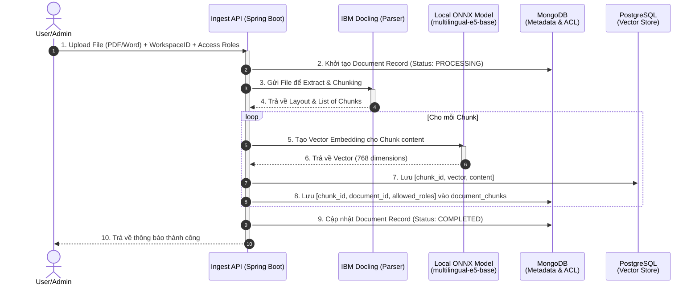
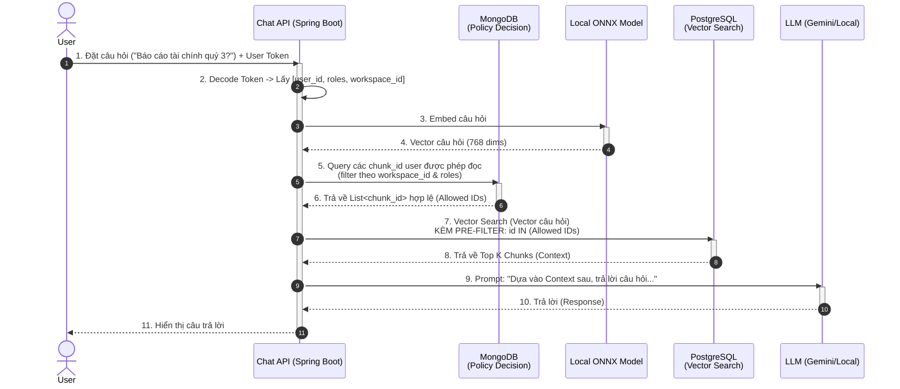

# Sơ đồ Kiến trúc Pipeline ETL & Truy xuất (Dual-Database)

Tài liệu này mô tả luồng xử lý dữ liệu từ dạng thô (PDF, Word) cho đến khi được lưu trữ vào hệ thống cơ sở dữ liệu kép (MongoDB + PostgreSQL) và luồng truy xuất thông tin (RAG Retrieval) có kiểm soát quyền truy cập (RBAC).

## 1. Pipeline Ingest (Xử lý và Lưu trữ Dữ liệu)

Đường ống này mô tả quá trình tài liệu nội bộ được đưa vào hệ thống. Điểm nhấn của kiến trúc là việc tách bạch lưu trữ: **MongoDB** lo Metadata và Phân quyền, trong khi **PgVector** lo tìm kiếm ngữ nghĩa.

## 2. Pipeline Retrieval (Truy xuất Thông tin an toàn)

Đường ống này đảm bảo rằng người dùng chỉ có thể lấy được context từ những chunk mà họ có quyền xem (RBAC - Role Based Access Control) trước khi đưa cho LLM tổng hợp câu trả lời.

## 3. Điểm mạnh của kiến trúc
1. **Security-First (Bảo mật tuyệt đối):** Việc truy vấn MongoDB lấy danh sách `chunk_id` được phép đọc giúp hệ thống loại bỏ hoàn toàn khả năng Data Leakage. LLM sẽ không bao giờ nhìn thấy context thuộc về phòng ban khác.
2. **Hiệu năng cao:** Dù gọi 2 Database, nhưng MongoDB đọc Index cực nhanh, và việc truyền mảng `Allowed IDs` vào PostgreSQL làm bộ lọc (Pre-filter) giúp Vector DB giảm thiểu không gian tìm kiếm, tăng tốc độ tính toán khoảng cách Cosine.
3. **Mở rộng linh hoạt:** Sẵn sàng cho Phase 3 (GraphRAG) vì MongoDB hỗ trợ tốt dữ liệu dạng JSON lồng nhau và Aggregation `$graphLookup`.
